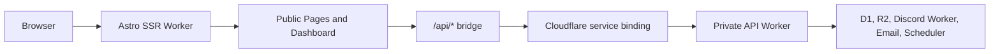
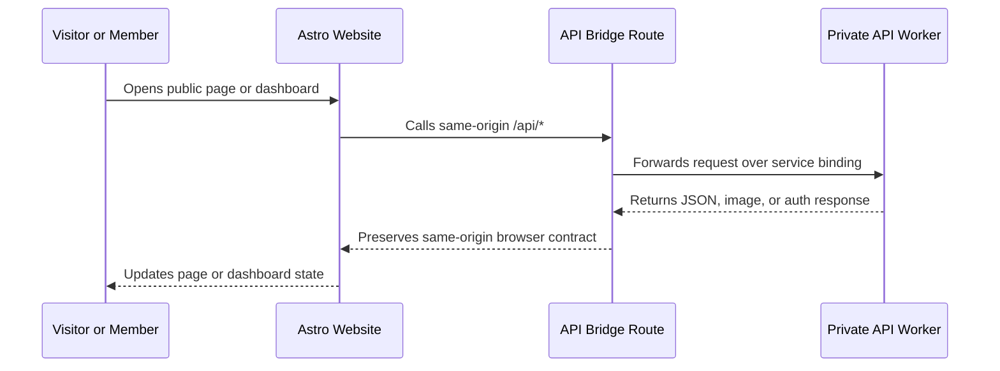

# Purdue Photo Website

<div align="center">

Astro and React frontend for Purdue Photography Club's public site, member dashboard, gallery, events, memberships, studio, darkroom, and equipment workflows.

[](https://github.com/PurduePhotographyClub/purdue-photo-website/actions/workflows/ci.yml)


</div>

## What It Does

This repo is the website layer for the club. It renders the public marketing pages, serves the authenticated dashboard, and forwards application API traffic to the private API Worker through a Cloudflare service binding. Browser traffic stays same-origin under `/api/*`, while the backend remains isolated from direct public routing.

## Product Areas

| Area | Purpose |
| --- | --- |
| Public site | Home, meetings, facilities, events, competitions, gallery, merch, and request forms |
| Member dashboard | Activation, account settings, notifications, gallery uploads, competition tools, and member workflows |
| Admin dashboard | Membership, keys, gallery, competitions, events, darkroom, studio, merch, newsletter, and equipment management |
| API bridge | Same-origin `/api/*` route that forwards to the private API Worker over a Cloudflare service binding |
| Performance layer | SWR fetch helpers, versioned API URL routing, thumbnail-aware gallery loading, and cached public JSON defaults |

## Architecture



## Request Flow



## Tech Stack

| Layer | Technology |
| --- | --- |
| App framework | Astro 6 with React islands |
| UI | React 18, Tailwind CSS 4, lucide-react, custom dashboard components |
| Data fetching | SWR and shared fetch helpers in `src/lib/http.ts` |
| Runtime | Cloudflare Workers via `@astrojs/cloudflare` |
| Auth client | Better Auth client integration |
| Human verification | Cloudflare Turnstile widgets on public forms |

## Development

```sh
npm install
npm run dev
```

Use the Wrangler preview script when checking service-binding behavior:

```sh
npm run dev:wrangler
```

Runtime configuration is managed outside this public repository through the hosting platform and Cloudflare bindings.

## Verification

```sh
npm run typecheck
npm run build
npm run doctor
npm run verify
```

CI runs install, typecheck, production build, React Doctor, and dependency/security checks.

## Project Map

```text
src/
  components/           Public site and dashboard React components
  components/dashboard/ Member and admin dashboard surfaces
  layouts/              Public and dashboard shells
  lib/                  HTTP helpers, auth client, cache helpers, shared domain utilities
  pages/                Astro routes and the /api bridge
public/
  hero/                 Local hero imagery
  merch/                Merch imagery
```

## Image And Asset Licensing

| Asset group | Source | License or usage note |
| --- | --- | --- |
| `public/ppc-logo.webp`, local hero, merch, and map assets | Purdue Photography Club project assets | Club-owned or used with club permission |
| Remote images from `images.unsplash.com` | Unsplash | Used under the [Unsplash License](https://unsplash.com/license) |
| User-submitted gallery and competition images | Uploaded by members through the dashboard/API | Displayed according to club submission permissions |
| UI primitives inspired by shadcn/ui | shadcn/ui | MIT license |

See `ATTRIBUTIONS.md` for the short attribution ledger.

## Repository Boundary

This repo contains the website only. API implementation, Discord side effects, email receipt ingestion, and scheduled jobs live in separate repos so each deployment can be reviewed, protected, and updated independently.
